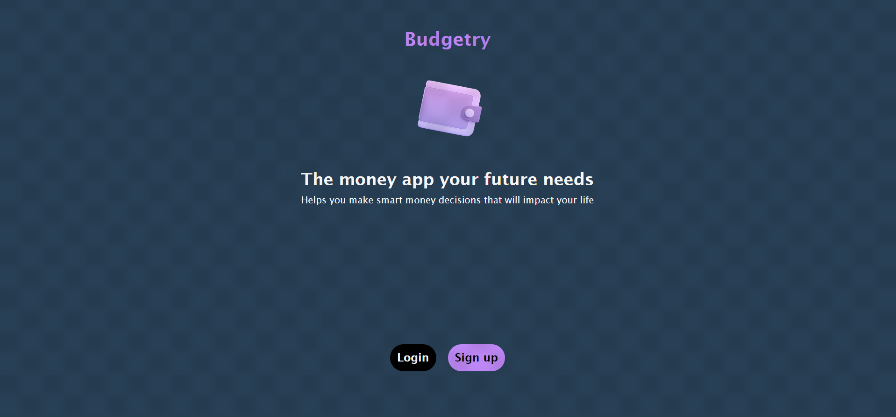

# Budget App

A Budget-app is mobile web application where you can manage your budget: you have a list of transactions associated with a category, so that you can see how much money you spent and on what.

## Live Version

[See Live Version](https://budgety-now.herokuapp.com/)
[Demo Video](https://www.loom.com/share/5147b906ad064f0b937a2ec2de1b4243)
## Built With

- Ruby
- Rails
- Postgresql

## Getting Started

To get a local copy up and running follow these simple example steps.

Start by cloning the repository.

`https://github.com/usorfaitheloho/budget-app.git`

Navigate to the created folder.

`cd budget-app`

### Prerequisites

- A Command Line Interface.
- Having Ruby installed.
- Setup Rails

### Install

To install rails, run `gem install rails on your terminal`

### Usage

### Run tests

To run tests enter `rspec` command on your terminal

## Authors

👤 **Faith Eloho Usor**

- GitHub: [@githubhandle](https://github.com/usorfaitheloho)
- LinkedIn: [LinkedIn](https://www.linkedin.com/in/faith-usor-16)

## 🤝 Contributing

Contributions, issues, and feature requests are welcome!

Feel free to check the [issues page](../../issues/).

## Show your support

Give a ⭐️ if you like this project!

## Acknowledgments

- Thanks to Microverse
- Great thanks to Gregoire Vella on Behance for design template.

## 📝 License

This project is [MIT](./MIT.md) licensed.
